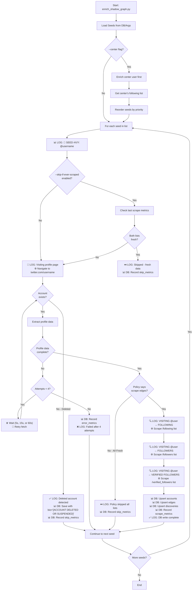
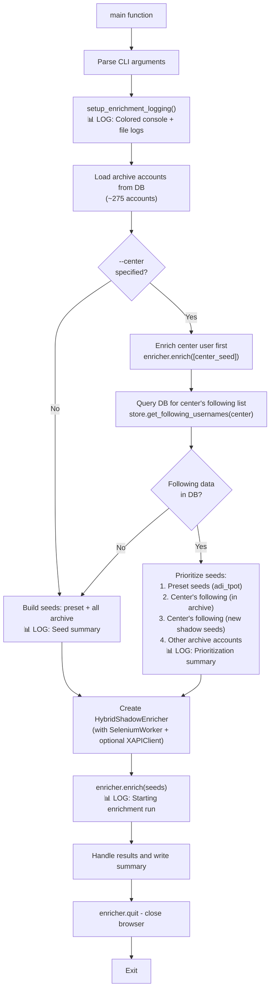
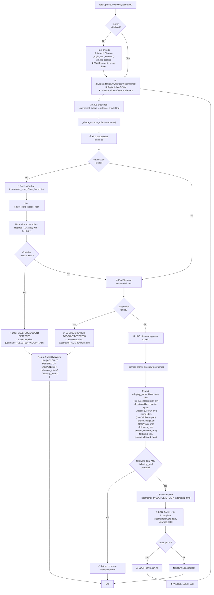
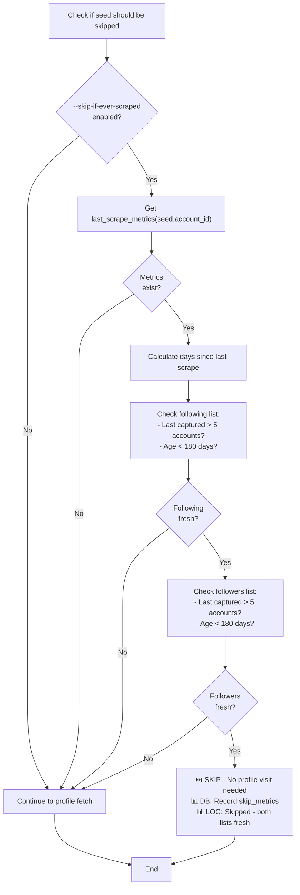
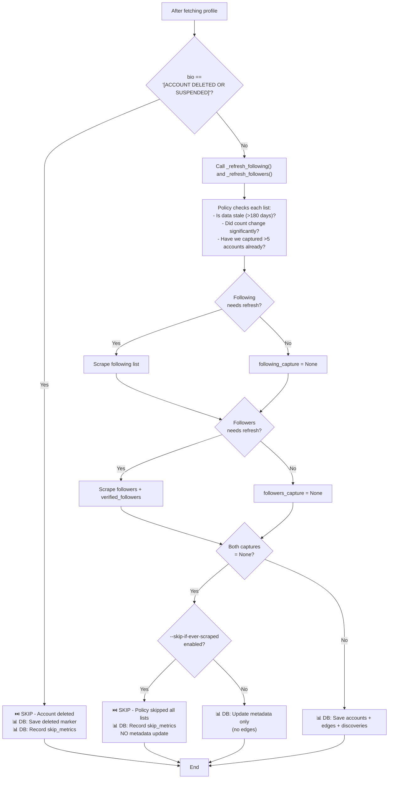

# Shadow Graph Enrichment Flow

Complete documentation of the Twitter/X account enrichment pipeline, including decision trees, database operations, and logging points.

---

## Table of Contents

1. [High-Level Overview](#high-level-overview)
2. [Database Schema](#database-schema)
3. [Main Enrichment Flow](#main-enrichment-flow)
4. [Profile Fetch Decision Tree](#profile-fetch-decision-tree)
5. [Deleted Account Detection](#deleted-account-detection)
6. [Edge Scraping Flow](#edge-scraping-flow)
7. [Skip Conditions](#skip-conditions)
8. [Logging Points](#logging-points)

---

## High-Level Overview

### ASCII Diagram

```
                        ┌─────────────────────────────┐
                        │ START: enrich_shadow_graph  │
                        └──────────────┬──────────────┘
                                       │
                        ┌──────────────▼──────────────┐
                        │  Load Seeds from DB/Args    │
                        └──────────────┬──────────────┘
                                       │
                        ┌──────────────▼──────────────┐
                        │   --center flag specified?  │
                        └───────┬──────────────┬──────┘
                          YES   │              │ NO
                       ┌────────▼──────┐       │
                       │ Enrich center │       │
                       │  user first   │       │
                       └────────┬──────┘       │
                                │              │
                       ┌────────▼──────┐       │
                       │ Get following │       │
                       │  list from DB │       │
                       └────────┬──────┘       │
                                │              │
                       ┌────────▼──────┐       │
                       │ Reorder seeds │       │
                       │ by priority   │       │
                       └────────┬──────┘       │
                                │              │
                        ┌───────▼──────────────▼──────┐
                        │  FOR EACH SEED in list      │
                        │  📊 LOG: 🔹 SEED #X/Y       │
                        └──────────────┬──────────────┘
                                       │
                        ┌──────────────▼──────────────┐
                        │ --skip-if-ever-scraped ON?  │
                        └───────┬──────────────┬──────┘
                          YES   │              │ NO
                       ┌────────▼──────┐       │
                       │ Check last    │       │
                       │ scrape metrics│       │
                       └────────┬──────┘       │
                                │              │
                       ┌────────▼──────┐       │
                       │ Both lists    │       │
                       │   fresh?      │       │
                       └───┬────────┬──┘       │
                      YES  │        │ NO       │
                  ┌────────▼──┐    │          │
                  │⏭️ SKIP    │    │          │
                  │ (pre-fetch)│   │          │
                  │📊 DB: Log │    │          │
                  └────────┬──┘    │          │
                           │    ┌──▼──────────▼──────┐
                           │    │ 📍 VISIT PROFILE    │
                           │    │ Navigate to         │
                           │    │ twitter.com/user    │
                           │    └──────────┬──────────┘
                           │               │
                           │    ┌──────────▼──────────┐
                           │    │  Account exists?    │
                           │    └───┬───────────┬─────┘
                           │  DELETED│           │EXISTS
                           │  ┌──────▼──────┐   │
                           │  │✅ DELETED   │   │
                           │  │ Mark & Save │   │
                           │  │ to DB       │   │
                           │  └──────┬──────┘   │
                           │         │          │
                           │         │   ┌──────▼──────┐
                           │         │   │  Extract    │
                           │         │   │  Profile    │
                           │         │   └──────┬──────┘
                           │         │          │
                           │         │   ┌──────▼──────┐
                           │         │   │  Complete?  │
                           │         │   └───┬───┬─────┘
                           │         │    NO │   │ YES
                           │         │  ┌────▼─┐ │
                           │         │  │Retry?│ │
                           │         │  │(4x)  │ │
                           │         │  └┬────┬┘ │
                           │         │YES│  NO│  │
                           │         │┌──▼┐ ┌▼──▼────────┐
                           │         ││Wait│ │Check edge  │
                           │         ││ &  │ │policy      │
                           │         ││Loop│ └┬──────────┬┘
                           │         │└────┘YES│        NO│
                           │         │  ┌──────▼─┐   ┌───▼────┐
                           │         │  │ Scrape │   │⏭️ SKIP │
                           │         │  │ Lists  │   │(policy)│
                           │         │  └────┬───┘   └───┬────┘
                           │         │       │           │
                           │         │  ┌────▼───────────▼────┐
                           │         │  │ 🔍 FOLLOWING         │
                           │         │  │ 🔍 FOLLOWERS         │
                           │         │  │ 🔍 VERIFIED          │
                           │         │  └────┬─────────────────┘
                           │         │       │
                           │         │  ┌────▼─────────────────┐
                           │         │  │ 📊 DB: Upsert all    │
                           │         │  │ (accounts/edges/etc) │
                           │         │  └────┬─────────────────┘
                           │         │       │
                        ┌──▼─────────▼───────▼──┐
                        │   More seeds to do?   │
                        └───────┬───────────┬───┘
                             YES│           │NO
                   ┌────────────┘           │
                   │ LOOP BACK              │
                   └──────┐        ┌────────▼────────┐
                          │        │   END           │
                          └────────│                 │
                                   └─────────────────┘
```

### Mermaid Diagram (GitHub/VS Code)



---

## Database Schema

### Table: `shadow_account`

Stores metadata for all enriched Twitter/X accounts.

```sql
CREATE TABLE shadow_account (
    account_id VARCHAR PRIMARY KEY,          -- Unique ID (archive ID or "shadow:username")
    username VARCHAR,                        -- Twitter handle (lowercase)
    display_name VARCHAR,                    -- Display name shown on profile
    bio VARCHAR,                             -- Profile bio (or "[ACCOUNT DELETED OR SUSPENDED]")
    location VARCHAR,                        -- User location
    website VARCHAR,                         -- User website URL
    profile_image_url VARCHAR,               -- Profile picture URL
    followers_count INTEGER,                 -- Claimed follower count
    following_count INTEGER,                 -- Claimed following count
    source_channel VARCHAR NOT NULL,         -- "selenium", "x_api", or "archive"
    fetched_at DATETIME NOT NULL,            -- When data was fetched
    checked_at DATETIME,                     -- Last verification time
    scrape_stats JSON,                       -- {"deleted": true} for deleted accounts
    is_shadow BOOLEAN NOT NULL DEFAULT TRUE  -- True for enriched accounts
);
```

**Special Values:**
- `bio = "[ACCOUNT DELETED OR SUSPENDED]"` → Account no longer exists
- `followers_count = 0, following_count = 0` → For deleted accounts
- `scrape_stats = {"deleted": true}` → Metadata flag

---

### Table: `shadow_edge`

Stores directed relationships (following/followers).

```sql
CREATE TABLE shadow_edge (
    source_id VARCHAR NOT NULL,              -- Account that follows
    target_id VARCHAR NOT NULL,              -- Account being followed
    direction VARCHAR NOT NULL,              -- "outbound" or "inbound"
    source_channel VARCHAR NOT NULL,         -- How edge was discovered
    fetched_at DATETIME NOT NULL,            -- When discovered
    checked_at DATETIME,                     -- Last verification
    weight INTEGER,                          -- Edge weight (unused currently)
    metadata JSON,                           -- Additional metadata
    PRIMARY KEY (source_id, target_id, direction)
);
```

**Direction Values:**
- `"outbound"` → source_id follows target_id
- `"inbound"` → target_id is followed by source_id

---

### Table: `shadow_discovery`

Tracks which seed led to discovering each account.

```sql
CREATE TABLE shadow_discovery (
    shadow_account_id VARCHAR NOT NULL,      -- Discovered account
    seed_account_id VARCHAR NOT NULL,        -- Seed that discovered it
    discovered_at DATETIME NOT NULL,         -- Discovery timestamp
    discovery_method VARCHAR NOT NULL,       -- "following", "followers", etc.
    PRIMARY KEY (shadow_account_id, seed_account_id)
);
```

---

### Table: `scrape_run_metrics`

Records every enrichment attempt (success, skip, or error).

```sql
CREATE TABLE scrape_run_metrics (
    id INTEGER PRIMARY KEY AUTOINCREMENT,
    seed_account_id VARCHAR NOT NULL,        -- Seed being enriched
    seed_username VARCHAR NOT NULL,          -- Username for logging
    run_at DATETIME NOT NULL,                -- Run timestamp
    duration_seconds FLOAT NOT NULL,         -- Time taken

    -- Capture counts
    following_captured INTEGER NOT NULL,     -- Accounts captured from /following
    followers_captured INTEGER NOT NULL,     -- Accounts captured from /followers
    followers_you_follow_captured INTEGER NOT NULL,

    -- Claimed totals (from profile)
    following_claimed_total INTEGER,         -- Profile says they follow X
    followers_claimed_total INTEGER,         -- Profile says X follow them
    followers_you_follow_claimed_total INTEGER,

    -- Coverage percentages (captured/claimed * 100)
    following_coverage FLOAT,                -- % of following list captured
    followers_coverage FLOAT,                -- % of followers captured
    followers_you_follow_coverage FLOAT,

    -- Database impact
    accounts_upserted INTEGER NOT NULL,      -- New accounts saved
    edges_upserted INTEGER NOT NULL,         -- New edges saved
    discoveries_upserted INTEGER NOT NULL,   -- New discoveries saved

    -- Skip/Error tracking
    skipped BOOLEAN NOT NULL DEFAULT FALSE,  -- Was this seed skipped?
    skip_reason VARCHAR,                     -- Why skipped (if skipped=true)
    error_type VARCHAR,                      -- Error type (if failed)
    error_details VARCHAR                    -- Error details
);
```

**Skip Reasons:**
- `"already_scraped_sufficient_coverage"` → Has complete data + good coverage
- `"both_lists_fresh_and_skip_if_ever_scraped_enabled"` → Pre-fetch optimization
- `"policy_skipped_all_edge_lists"` → Post-fetch, policy said skip
- `"account_deleted_or_suspended"` → Deleted account detected
- `"profile_overview_missing"` → Failed to fetch profile

**Error Types:**
- `"profile_overview_missing"` → Could not fetch profile after retries
- `null` → No error (successful or skipped)

---

## Main Enrichment Flow

### Entry Point: `scripts/enrich_shadow_graph.py`



---

## Profile Fetch Decision Tree

### Method: `enricher.enrich(seeds)` → `selenium_worker.fetch_profile_overview(username)`



---

## Deleted Account Detection

### Unicode Apostrophe Handling

Twitter uses **fancy Unicode apostrophes** instead of regular ASCII apostrophes:

#### ASCII Diagram

```
    ┌───────────────────────────────────┐
    │   Twitter HTML Returns:           │
    │   "This account doesn't exist"    │
    │   (U+2019 = fancy apostrophe ')   │
    └──────────────┬────────────────────┘
                   │
                   │ WITHOUT NORMALIZATION
                   ├─────────────────────────────┐
                   │                             │
                   │ WITH NORMALIZATION          │
                   │ .replace('\u2019', "'")     │
                   │ .replace('\u2018', "'")     │
                   │                             │
                   ▼                             ▼
    ┌──────────────────────────┐    ┌──────────────────────────┐
    │ "This account doesn't    │    │ "This account doesn't    │
    │  exist" (U+0027 = ')     │    │  exist" (U+2019 = ')     │
    └──────────────┬───────────┘    └──────────────┬───────────┘
                   │                               │
                   │ Check: "doesn't exist" in     │ Check: "doesn't exist" in
                   │        text                   │        text
                   │                               │
                   ▼                               ▼
    ┌──────────────────────────┐    ┌──────────────────────────┐
    │  ✅ MATCH FOUND          │    │  ❌ NO MATCH             │
    │  Account is DELETED      │    │  Wastes 4 retries (95s)  │
    └──────────────────────────┘    └──────────────────────────┘
```

#### Mermaid Diagram (GitHub/VS Code)

```mermaid
flowchart LR
    TwitterHTML["Twitter HTML:<br/>'This account doesn't exist'<br/>(U+2019 ')"] --> Normalize["Normalize:<br/>.replace('\\u2019', \"'\")<br/>.replace('\\u2018', \"'\")"]
    Normalize --> NormalizedText["'This account doesn't exist'<br/>(U+0027 ')"]
    NormalizedText --> Match["Match with:<br/>\"doesn't exist\"<br/>✅ SUCCESS"]

    TwitterHTML -.->|Without normalization| DirectMatch["Match with:<br/>\"doesn't exist\"<br/>❌ FAILS"]
```

**Key Code:**
```python
text_normalized = text.lower().replace('\u2019', "'").replace('\u2018', "'")
if "doesn't exist" in text_normalized:
    return False  # Account deleted
```

---

## Edge Scraping Flow

### Method: `selenium_worker._collect_user_list(username, list_type)`

#### ASCII Diagram

```
                ┌────────────────────────────────────┐
                │ _collect_user_list(user, listtype)│
                └─────────────────┬──────────────────┘
                                  │
                ┌─────────────────▼──────────────────┐
                │ 🌐 Navigate to:                    │
                │ twitter.com/user/following         │
                │ twitter.com/user/followers         │
                └─────────────────┬──────────────────┘
                                  │
                ┌─────────────────▼──────────────────┐
                │ 📊 LOG: 🔍 VISITING @user → TYPE  │
                │ ══════════════════════════════════ │
                └─────────────────┬──────────────────┘
                                  │
                ┌─────────────────▼──────────────────┐
                │ Initialize:                        │
                │ • discovered = {}                  │
                │ • extraction_counter = 0           │
                │ • stagnant_scrolls = 0             │
                └─────────────────┬──────────────────┘
                                  │
       ┌──────────────────────────▼────────────────────────────┐
       │           SCROLL LOOP (until stagnant)                │
       └──────────────────────────┬────────────────────────────┘
                                  │
                ┌─────────────────▼──────────────────┐
                │ Find all cells on page:            │
                │ div[data-testid="cellInnerDiv"]    │
                └─────────────────┬──────────────────┘
                                  │
                ┌─────────────────▼──────────────────┐
                │ FOR EACH CELL:                     │
                └─────────────────┬──────────────────┘
                                  │
                ┌─────────────────▼──────────────────┐
                │ Extract @handle from <a> links     │
                └─────────────────┬──────────────────┘
                                  │
                         ┌────────▼────────┐
                         │ Handle found?   │
                         └────┬───────┬────┘
                          NO  │       │ YES
                   ┌──────────┘       └──────────┐
                   │                              │
            ┌──────▼────────┐          ┌─────────▼─────────┐
            │ Skip to next  │          │ Already captured? │
            │     cell      │          └─────────┬─────────┘
            └──────┬────────┘                    │
                   │                  ┌──────────┴──────────┐
                   │               YES│                     │NO
                   │         ┌─────────▼──────┐   ┌─────────▼──────┐
                   │         │ DEBUG: [DUP]   │   │ Extract fields:│
                   │         │  @handle       │   │ • display_name │
                   │         └─────────┬──────┘   │ • bio (clean)  │
                   │                   │          │ • website      │
                   │                   │          │ • profile_img  │
                   │                   │          └────────┬───────┘
                   │                   │                   │
                   │                   │          ┌────────▼───────┐
                   │                   │          │ counter++      │
                   │                   │          └────────┬───────┘
                   │                   │                   │
                   │                   │          ┌────────▼───────────────────┐
                   │                   │          │ 📊 LOG: N. ✓ @handle      │
                   │                   │          │        (name) - "bio..."   │
                   │                   │          └────────┬───────────────────┘
                   │                   │                   │
                   │                   │          ┌────────▼───────┐
                   │                   │          │ Add to         │
                   │                   │          │ discovered{}   │
                   │                   │          └────────┬───────┘
                   │                   │                   │
                   └───────────────────┴───────────────────┘
                                       │
                            ┌──────────▼──────────┐
                            │ More cells to scan? │
                            └──────┬─────────┬────┘
                               YES │         │ NO
                     ┌─────────────┘         └─────────────┐
                     │ LOOP TO NEXT CELL                   │
                     │                          ┌───────────▼───────────┐
                     │                          │ 🖱️ Scroll page down   │
                     │                          │ window.scrollBy(1200) │
                     │                          └───────────┬───────────┘
                     │                                      │
                     │                          ┌───────────▼───────────┐
                     │                          │ ⏸️ Wait (random)      │
                     │                          │ 5s - 10s              │
                     │                          └───────────┬───────────┘
                     │                                      │
                     │                          ┌───────────▼───────────┐
                     │                          │ Check page height     │
                     │                          └───────────┬───────────┘
                     │                                      │
                     │                          ┌───────────▼───────────┐
                     │                          │ Height changed?       │
                     │                          └──┬────────────────┬───┘
                     │                          YES│                │NO
                     │                    ┌────────▼──────┐  ┌──────▼──────────┐
                     │                    │ stagnant = 0  │  │ stagnant++      │
                     │                    │ (new content) │  │ (no new data)   │
                     │                    └────────┬──────┘  └──────┬──────────┘
                     │                             │                │
                     │                             └────────┬───────┘
                     │                                      │
                     │                          ┌───────────▼───────────┐
                     │                          │ stagnant >= max (6)?  │
                     │                          └──┬────────────────┬───┘
                     │                          NO │                │ YES
                     └──────────────────────────────┘                │
                                                         ┌────────────▼────────────┐
                                                         │ 📊 LOG: ✅ CAPTURED     │
                                                         │ N unique accounts       │
                                                         │ ═══════════════════════ │
                                                         └────────────┬────────────┘
                                                                      │
                                                         ┌────────────▼────────────┐
                                                         │ Return UserListCapture  │
                                                         │ (captured_users,        │
                                                         │  claimed_total)         │
                                                         └─────────────────────────┘
```

#### Mermaid Diagram (GitHub/VS Code)

```mermaid
flowchart TD
    Start["_collect_user_list(username, list_type)"] --> Navigate["🌐 Navigate to twitter.com/{username}/{list_type}<br/>list_type = 'following', 'followers', etc."]
    Navigate --> LogSection["📊 LOG: 🔍 VISITING @{username} → {LIST_TYPE}<br/>═════════════════════════════"]
    LogSection --> InitScroll["Initialize:<br/>- discovered = {}<br/>- extraction_counter = 0<br/>- scroll_round = 0<br/>- stagnant_scrolls = 0"]

    InitScroll --> ScrollLoop{stagnant_scrolls <<br/>max_no_change_scrolls?}

    ScrollLoop -->|Yes| Done
    ScrollLoop -->|No| GetCells["Find all cells:<br/>driver.find_elements(By.CSS_SELECTOR, 'div[data-testid=\"cellInnerDiv\"]')"]

    GetCells --> ForEachCell["For each cell in cells"]
    ForEachCell --> ExtractHandle["Extract @handle from links"]
    ExtractHandle --> HasHandle{Handle<br/>extracted?}

    HasHandle -->|No| NextCell[Skip to next cell]
    HasHandle -->|Yes| AlreadyCaptured{Already in<br/>discovered?}

    AlreadyCaptured -->|Yes| LogDup["📊 DEBUG: [DUP] @handle"]
    AlreadyCaptured -->|No| ExtractFields["Extract:<br/>- display_name<br/>- bio (with apostrophe cleaning)<br/>- website<br/>- profile_image_url"]

    LogDup --> NextCell

    ExtractFields --> IncrementCounter["extraction_counter++"]
    IncrementCounter --> LogExtraction["📊 LOG: {counter}. ✓ @{handle} ({name}) - \"{bio}\""]
    LogExtraction --> AddToDiscovered["discovered[handle] = CapturedUser(...)"]
    AddToDiscovered --> NextCell

    NextCell --> MoreCells{More<br/>cells?}
    MoreCells -->|Yes| ForEachCell
    MoreCells -->|No| Scroll["🖱️ Scroll to bottom<br/>driver.execute_script('window.scrollTo(0, document.body.scrollHeight)')"]

    Scroll --> WaitForLoad["⏸️ Wait (scroll_delay_min to scroll_delay_max)"]
    WaitForLoad --> CheckHeight["new_height = document.body.scrollHeight"]
    CheckHeight --> HeightChanged{height<br/>changed?}

    HeightChanged -->|Yes| ResetStagnant["stagnant_scrolls = 0<br/>scroll_round++"]
    HeightChanged -->|No| IncrementStagnant["stagnant_scrolls++<br/>scroll_round++"]

    ResetStagnant --> ScrollLoop
    IncrementStagnant --> ScrollLoop

    Done["📊 LOG: ✅ CAPTURED {count} unique accounts<br/>═════════════════════════════"]
    Done --> ReturnResults["Return UserListCapture(<br/>  captured_users=list(discovered.values()),<br/>  claimed_total=profile_claimed_total<br/>)"]
    ReturnResults --> End[End]
```

---

## Skip Conditions

### Pre-Fetch Skip (Before Profile Visit)

#### ASCII Diagram

```
                ┌───────────────────────────────┐
                │ Check if seed can be skipped  │
                └──────────────┬────────────────┘
                               │
                ┌──────────────▼────────────────┐
                │ --skip-if-ever-scraped ON?    │
                └───────┬──────────────┬─────────┘
                     NO │              │ YES
        ┌───────────────┘              └───────────────┐
        │                                              │
        │                              ┌───────────────▼────────────┐
        │                              │ Get last_scrape_metrics    │
        │                              │ from database              │
        │                              └───────────────┬────────────┘
        │                                              │
        │                              ┌───────────────▼────────────┐
        │                              │ Metrics exist in DB?       │
        │                              └───────┬───────────┬────────┘
        │                                   NO │           │ YES
        │                  ┌───────────────────┘           └──────────────┐
        │                  │                                              │
        │                  │                   ┌──────────────────────────▼──────┐
        │                  │                   │ Check FOLLOWING list:            │
        │                  │                   │ • Last captured > 5 accounts?    │
        │                  │                   │ • Age < 180 days?                │
        │                  │                   └──────────────────────────┬──────┘
        │                  │                                              │
        │                  │                   ┌──────────────────────────▼──────┐
        │                  │                   │ Following list fresh?            │
        │                  │                   └──────┬──────────────────┬────────┘
        │                  │                       NO │                  │ YES
        │                  │          ┌────────────────┘                 │
        │                  │          │                   ┌──────────────▼──────────┐
        │                  │          │                   │ Check FOLLOWERS list:    │
        │                  │          │                   │ • Last captured > 5      │
        │                  │          │                   │ • Age < 180 days?        │
        │                  │          │                   └──────────────┬───────────┘
        │                  │          │                                  │
        │                  │          │                   ┌──────────────▼───────────┐
        │                  │          │                   │ Followers list fresh?    │
        │                  │          │                   └──────┬──────────┬────────┘
        │                  │          │                       NO │          │ YES
        │                  │          │                          │          │
        └──────────────────┴──────────┴──────────────────────────┘          │
                           │                                                │
        ┌──────────────────▼───────────────────┐        ┌──────────────────▼─────────────────┐
        │ CONTINUE TO PROFILE FETCH            │        │ ⏭️ SKIP - Both lists fresh        │
        │ (Visit twitter.com/user)             │        │ 📊 DB: Record skip_metrics         │
        └──────────────────────────────────────┘        │ 📊 LOG: Skipped - fresh data       │
                                                         │ ✅ NO profile visit needed         │
                                                         └────────────────────────────────────┘
```

#### Mermaid Diagram (GitHub/VS Code)



### Post-Fetch Skip (After Profile Visit)

#### ASCII Diagram

```
            ┌──────────────────────────────────────┐
            │ Profile fetched from twitter.com/user│
            └────────────────┬─────────────────────┘
                             │
            ┌────────────────▼─────────────────────┐
            │ bio == "[ACCOUNT DELETED OR          │
            │        SUSPENDED]" ?                 │
            └───────┬──────────────────┬───────────┘
                 YES│                  │NO
        ┌───────────▼─────────┐        │
        │ ⏭️ SKIP - Deleted   │        │
        │ 📊 DB: Save marker  │        │
        │ (no edge scraping)  │        │
        └─────────────────────┘        │
                                       │
                        ┌──────────────▼──────────────┐
                        │ Call _refresh_following()   │
                        │ and _refresh_followers()    │
                        └──────────────┬──────────────┘
                                       │
                        ┌──────────────▼──────────────┐
                        │ Policy checks for each list:│
                        │ • Stale? (>180 days)        │
                        │ • Count changed?            │
                        │ • Already captured >5?      │
                        └──────────────┬──────────────┘
                                       │
                        ┌──────────────▼──────────────┐
                        │ Following list needs        │
                        │ refresh?                    │
                        └───────┬────────────┬────────┘
                             YES│            │NO
                    ┌───────────▼──┐    ┌────▼─────────────┐
                    │ Scrape       │    │ following_capture│
                    │ /following   │    │ = None (skip)    │
                    └───────────┬──┘    └────┬─────────────┘
                                │            │
                                └──────┬─────┘
                                       │
                        ┌──────────────▼──────────────┐
                        │ Followers list needs        │
                        │ refresh?                    │
                        └───────┬────────────┬────────┘
                             YES│            │NO
                    ┌───────────▼──┐    ┌────▼─────────────┐
                    │ Scrape       │    │ followers_capture│
                    │ /followers + │    │ = None (skip)    │
                    │ /verified    │    └────┬─────────────┘
                    └───────────┬──┘         │
                                │            │
                                └──────┬─────┘
                                       │
                        ┌──────────────▼──────────────┐
                        │ Both captures = None?       │
                        │ (policy skipped all lists)  │
                        └───────┬────────────┬────────┘
                             YES│            │NO
                    ┌───────────▼──┐         │
                    │--skip-if-ever│         │
                    │-scraped ON?  │         │
                    └───┬──────┬───┘         │
                     YES│   NO │             │
        ┌───────────────▼┐ ┌──▼────────┐    │
        │⏭️ SKIP         │ │ Update    │    │
        │(no metadata    │ │ metadata  │    │
        │ update)        │ │ only      │    │
        │📊 DB: skip log │ │ (no edges)│    │
        └────────────────┘ └───────────┘    │
                                             │
                              ┌──────────────▼──────────────┐
                              │ 📊 DB: Save everything:     │
                              │ • Accounts (profile data)   │
                              │ • Edges (following/follower)│
                              │ • Discoveries (seed trace)  │
                              │ • Scrape metrics            │
                              └─────────────────────────────┘
```

#### Mermaid Diagram (GitHub/VS Code)



---

## Logging Points

### Console Logs (Visible to User)

| Level | Message | Location | Purpose |
|-------|---------|----------|---------|
| INFO | `Starting enrichment run: N seeds total` | enricher.py:628 | Show total seeds |
| INFO | `🔹 SEED #X/Y: @username` | enricher.py:638 | Mark each seed start |
| INFO | `⏭️ SKIPPED — complete profile and edge data found in DB` | enricher.py:676 | Skip reason (coverage) |
| INFO | `⏭️ SKIPPED — both edge lists are fresh` | enricher.py:778 | Skip reason (pre-fetch) |
| INFO | `📍 Visiting profile page for @username...` | enricher.py:814 | Profile visit |
| WARNING | `🔍 CHECKING EXISTENCE for @username` | selenium_worker.py:654 | Start existence check |
| WARNING | `✅ DELETED ACCOUNT DETECTED` | selenium_worker.py:674 | Deleted account found |
| WARNING | `⏭️ SKIPPED — account deleted or suspended` | enricher.py:849 | Deleted account skip |
| INFO | `🔍 VISITING @user → FOLLOWING` | selenium_worker.py:283 | Edge scraping start |
| INFO | `  1. ✓ @handle (name) - "bio"` | selenium_worker.py:389 | Each account extracted |
| INFO | `✅ CAPTURED N unique accounts from @user → FOLLOWING` | selenium_worker.py:421 | Edge scraping end |
| INFO | `Writing to DB for @username` | enricher.py | DB write start |
| INFO | `DB write complete: N accounts, N edges` | enricher.py | DB write end |

### File Logs (logs/enrichment.log)

All console logs PLUS:
- DEBUG: Every scroll action
- DEBUG: Every element found/not found
- DEBUG: Duplicate detections
- DEBUG: Delay timings
- DEBUG: Cookie loading steps

### HTML Snapshots (logs/*.html)

| Filename Pattern | When Created | Purpose |
|------------------|--------------|---------|
| `snapshot_{user}_before_existence_check_{timestamp}.html` | Before checking if account exists | Debug existence check |
| `snapshot_{user}_emptyState_found_{timestamp}.html` | When emptyState element found | Verify deletion message |
| `snapshot_{user}_DELETED_ACCOUNT_{timestamp}.html` | When deletion confirmed | Confirm detection worked |
| `snapshot_{user}_SUSPENDED_{timestamp}.html` | When account suspended | Verify suspension message |
| `snapshot_{user}_INCOMPLETE_DATA_attempt{N}_{timestamp}.html` | Each retry for incomplete data | Debug missing fields |
| `snapshot_{user}_profile-incomplete_{timestamp}.html` | Profile missing fields | Debug extraction failure |
| `snapshot_{user}_list_{list_type}-timeout_{timestamp}.html` | List scraping timeout | Debug scroll issues |

---

## Performance Metrics

### Timing Breakdown (Typical)

| Phase | Duration | Notes |
|-------|----------|-------|
| Browser startup | 2-5s | First seed only |
| Cookie loading | 10-30s | One delay per cookie |
| Navigate to profile | 2-5s | Per profile visit |
| Profile extraction | 1-3s | If successful |
| Profile retries | 5-95s | If incomplete (5s + 15s + 60s + 60s) |
| Navigate to list | 2-3s | Per list (following/followers) |
| Scroll & extract (small <50) | 10-30s | Per list |
| Scroll & extract (medium 50-200) | 30-120s | Per list |
| Scroll & extract (large >200) | 120-300s | Per list, may hit scroll limit |
| DB write | 0.5-2s | Per seed |

**Average seed (medium account):** ~180-300s (3-5 minutes)

### Optimization Flags

| Flag | Impact | Savings |
|------|--------|---------|
| `--skip-if-ever-scraped` | Skip seeds with complete + fresh data | ~90-300s per skipped seed |
| Pre-fetch optimization | Skip profile visit if both lists fresh | ~15-30s per skipped seed |
| Post-fetch optimization | Skip metadata update if policy skips all lists | ~2-5s per seed |
| `--delay-min 1 --delay-max 2` | Reduce delays | ~10-20s per seed |
| `--auto-continue` | Skip manual confirmation | Unlimited (manual wait) |
| `--quiet` | Auto-select cookie file | Unlimited (manual wait) |

---

## Common Queries

### Find all deleted accounts
```sql
SELECT username, display_name, fetched_at
FROM shadow_account
WHERE bio = '[ACCOUNT DELETED OR SUSPENDED]'
ORDER BY fetched_at DESC;
```

### Get enrichment success rate (last 7 days)
```sql
SELECT
    COUNT(*) as total_runs,
    SUM(CASE WHEN skipped = 0 AND error_type IS NULL THEN 1 ELSE 0 END) as successful,
    SUM(CASE WHEN skipped = 1 THEN 1 ELSE 0 END) as skipped,
    SUM(CASE WHEN error_type IS NOT NULL THEN 1 ELSE 0 END) as errored,
    ROUND(AVG(duration_seconds), 2) as avg_duration_sec,
    ROUND(AVG(following_coverage), 2) as avg_following_coverage_pct,
    ROUND(AVG(followers_coverage), 2) as avg_followers_coverage_pct
FROM scrape_run_metrics
WHERE run_at > datetime('now', '-7 days');
```

### Find accounts with low coverage (<10%)
```sql
SELECT
    sa.username,
    sa.followers_count,
    sa.following_count,
    srm.following_captured,
    srm.followers_captured,
    ROUND(srm.following_coverage, 2) as following_pct,
    ROUND(srm.followers_coverage, 2) as followers_pct
FROM shadow_account sa
JOIN scrape_run_metrics srm ON sa.account_id = srm.seed_account_id
WHERE (srm.following_coverage < 10 OR srm.followers_coverage < 10)
    AND srm.run_at = (
        SELECT MAX(run_at)
        FROM scrape_run_metrics
        WHERE seed_account_id = sa.account_id
    )
ORDER BY srm.run_at DESC
LIMIT 50;
```

### Get skip reason breakdown
```sql
SELECT
    skip_reason,
    COUNT(*) as count,
    ROUND(COUNT(*) * 100.0 / (SELECT COUNT(*) FROM scrape_run_metrics WHERE skipped = 1), 2) as pct
FROM scrape_run_metrics
WHERE skipped = 1
GROUP BY skip_reason
ORDER BY count DESC;
```

---

## Troubleshooting Guide

### Issue: "Profile data incomplete" retries
**Symptoms:** Logs show 4 retry attempts, wasting ~95 seconds

**Diagnosis:**
1. Check HTML snapshot: `logs/snapshot_{user}_INCOMPLETE_DATA_attempt1_*.html`
2. Look for missing `followers_total` or `following_total` in profile header
3. Common causes:
   - Account is deleted (should be caught by existence check)
   - Twitter rate limiting (slow page load)
   - DOM structure changed

**Fix:**
- If deleted: Check if Unicode apostrophe normalization is working
- If rate limited: Increase `--delay-min` and `--delay-max`
- If DOM changed: Update CSS selectors in `_extract_profile_overview()`

### Issue: "Account deleted" not detected
**Symptoms:** Retries happen even though account is deleted

**Diagnosis:**
1. Check `logs/snapshot_{user}_emptyState_found_*.html`
2. Search for "doesn't exist" or "doesn't exist" (fancy apostrophe)
3. Verify `_check_account_exists()` is being called

**Fix:**
- Check Unicode normalization: `.replace('\u2019', "'").replace('\u2018', "'")`
- Verify `emptyState` element exists in snapshot
- Check for new error message variations from Twitter

### Issue: Missing data in edge lists
**Symptoms:** Captured count doesn't match browser view

**Diagnosis:**
1. Check numbered logs: `  1. ✓ @user ...`, `  2. ✓ @user ...`
2. Compare count in logs vs. browser
3. Check if scroll stopped early: `stagnant_scrolls` hit max

**Fix:**
- Increase `--max-scrolls` (default 6, try 20+ for large accounts)
- Increase scroll delays: `--delay-min 3 --delay-max 8`
- Check for DOM changes in `_collect_user_list()`

---

## File Structure

```
tpot-analyzer/
├── scripts/
│   └── enrich_shadow_graph.py      # Entry point, CLI args, seed construction
├── src/
│   ├── shadow/
│   │   ├── enricher.py              # Orchestrator, decision logic, DB ops
│   │   ├── selenium_worker.py       # Browser automation, scraping
│   │   └── x_api_client.py          # Optional X API fallback (unused by default)
│   └── data/
│       └── shadow_store.py          # DB abstraction layer
├── logs/
│   ├── enrichment.log               # Rotating log file (5MB max, 5 backups)
│   └── snapshot_*.html              # HTML snapshots for debugging
└── data/
    └── cache.db                     # SQLite database
```

---

## Architecture Principles

1. **Fail-safe**: Assume account exists if detection fails (no false positives)
2. **Idempotent**: Safe to re-run on same seeds (upsert operations)
3. **Auditable**: Every run recorded in `scrape_run_metrics`
4. **Recoverable**: HTML snapshots for post-mortem debugging
5. **Optimized**: Multiple skip conditions to avoid wasted work
6. **Observable**: Numbered logs, progress tracking, clear skip reasons

---

## Related Documentation

- [SCRAPE_DEBUG_GUIDE.md](./SCRAPE_DEBUG_GUIDE.md) - Debugging deleted account detection
- [TEST_MODE.md](./TEST_MODE.md) - Running in test mode with small subset
- [CENTER_USER_FIX.md](./CENTER_USER_FIX.md) - Seed prioritization details
- [BUGFIXES.md](./BUGFIXES.md) - Known issues and fixes
